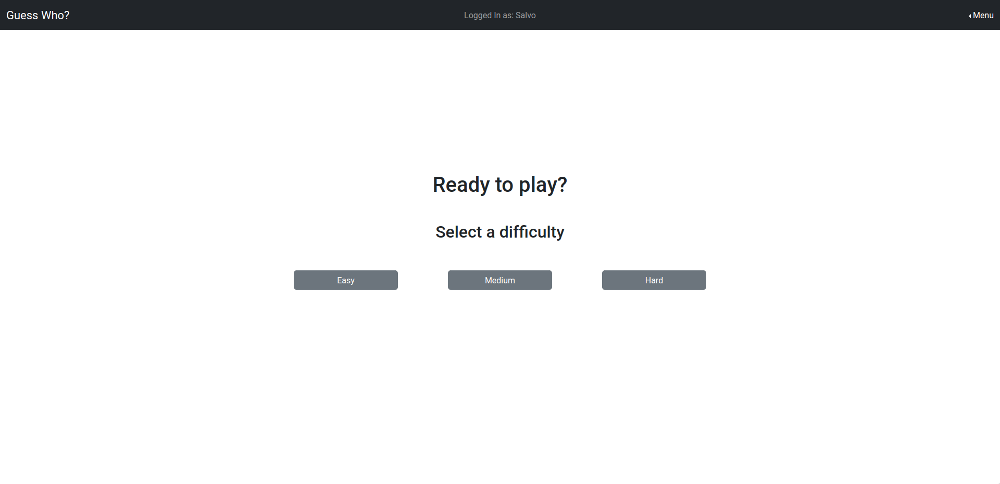
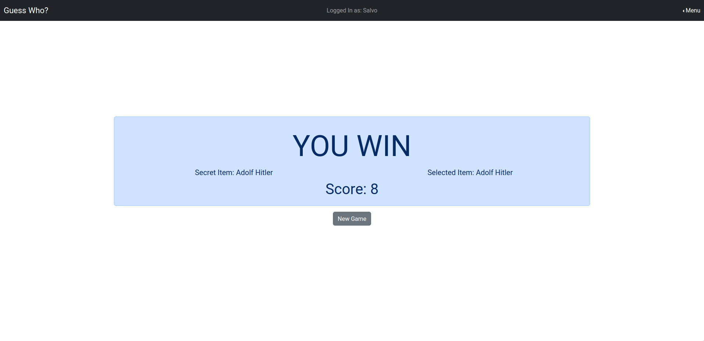
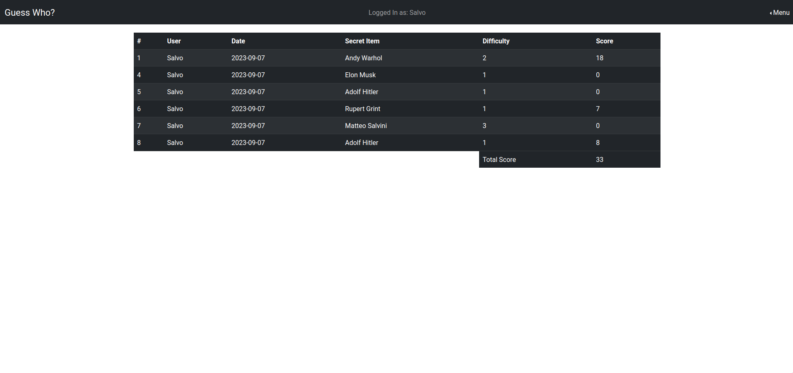

[](https://classroom.github.com/a/-RTLSo1u)
# Exam #3: "Guess Who?"

## Student: s314701 GIARRACCA SALVATORE

# Server side

## API Server

- POST `/session`
  - request body: { username: string , password: string }
  ```json
      { "username": "salvo@test.com", "password": "psw" }
  ```
  - response body: { id: integer, name: string, email: string }
  ```json
      { "id": 1, "name": "Salvo", "email": "salvo@test.com" }
  ```
- GET `/session/current`
  - request body: none (but session cookie)
  - response body: { id: integer, name: string, email: string }
  ```json
      { "id": 1, "name": "Salvo", "email": "salvo@test.com" }
  ```
- DELETE `/logout`
  - request body: none (but session cookie)
  - response body: {message: string}
  ```json
      { "message": "logged out" }
  ```
- GET `/games`
- request body: none (but session cookie)
- response body: { matches: matches, totalScore: totalScore, message: "OK" }
  ```json
      { 
        "matches": [ { "id": 1, "name": "Salvo", "secretItem": "Margot Robbie", "status": "Complete", "difficulty": 2, "score": "18" } ],
        "totalScore": 18,
        "message": "OK" 
      }
  ```
- POST `/games`
- request body: {difficulty: integer}
- response body: {id: gameId, items: items, properties: currentProperties, message: "done"}
  ```json
      {
        "id": 1,
        "items": [ { }, { }, { } ], 
        "properties": [ { }, { } ], 
        "message": "logged out" 
      }
  ```
- POST `/games/:id/property`
- request params: id: number (gameId)
- request body: { name: string, value: string }
- response body: { result: boolean, message: "ok" }
  ```json
      { "result": true, "message": "ok" }
  ```
- PUT `/games/:id/item`
- request params: id: number (gameId)
- request body: { itemName: string }
- response body: { game: completedMatch, result: result, message: message.message }
  ```json
      {
        "game": { "id": 1, "name": "Salvo", "secretItem": "Margot Robbie", "status": "Complete", "difficulty": 2, "score": "18" }, 
        "result": true, 
        "message": "Game finished" 
      }
  ```

## Database Tables

- Table `users` - contains (id, name, email, salt, hash)
- Table `items` - contains (id, name, image_name, sex, skin, job, alive, glasses, eyes, hair, beard)
- Table `matches` - contains (id, user, date, date, status, secretItem, difficulty, score)

# Client side


## React Client Application Routes

- Route `/`: Contains NavBar and Homepage: it's purpose consist in selection of difficulty, then on difficulty selection the app navigate to `/play`
- Route `/play`: Contains NavBar and Game components such items list and properties list. Here the game start after the pressure of Start Game button.
- Route `/stats`: Contains the NavBar and a table of matches of the logged in player. This is wrapped in a protected route component that prevent unauthorized users to navigate to this page
- Route `/login`: Contains NavBar and Login form. From here the user can perform authentication and be redirected to Homepage if authorized.
- Route `*`: Contains an error message and a button to return to the Homepage if route does not exist.


## Main React Components
### `index.hooks.js` contains the logic of the component
### `index.jsx` perform the rendering of the component
###

- `Home` (in `pages/Home/index.jsx`): It's purpose is to let player select the difficulty
- `Game` (in `pages/Game/index.jsx`): It's purpose is to render the list of items and the properties to guess associated to them
- `ItemsList` (in `components/ItemsList/index.jsx`): It's purpose is to render the list of items 
- `Login` (in `pages/Login/index.jsx`): It's purpose is to render the Login Form
- `Statistics` (in `pages/Login/index.jsx`): It's purpose is to render the table with the previous matches of the player
- `PropertiesList` (in `components/PropertyList/index.jsx`): It's purpose is to render the list of properties
- `NavBar` (in `components/NavBar/index.jsx`): It's purpose is to render the NavBar with the login button to perform the Login
- `ProtectedRoute` (in `components/ProtectedPage/index.jsx`): It's purpose is to protect the user to navigate in stats page


# Usage info

## Instructions
### `node.js` must be installed on the system

- Open a terminal inside `server` directory and run:
```
npm i
nodemon index.js 
```
- Open a terminal inside `client` directory and run:
```
npm i
npm run dev 
```

## Example Screenshot






## Users Credentials

| User   | Email           | Password |
|--------|-----------------|----------|
| Salvo  | salvo@test.com  | psw      |
| Mario  | mario@test.com  | psw      |
| Ciccio | ciccio@test.com | psw      |


